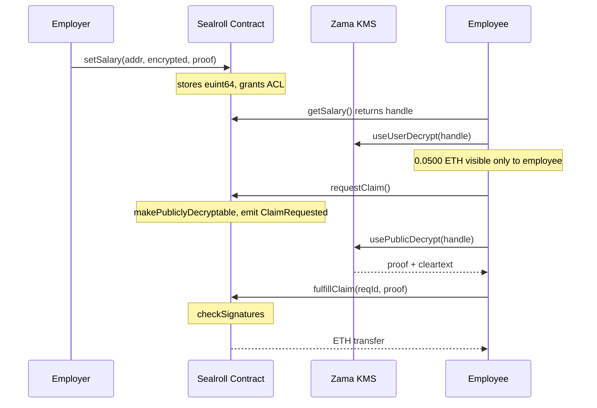

# Sealroll

**Confidential payroll on Ethereum, powered by Zama fhEVM.**

Pay your team without exposing their salaries on a public blockchain. Salaries are encrypted on-chain. Only the people you pay can read what they earn. Real ETH transfers, no off-chain trust.

[Live demo](https://sealroll.vercel.app) · [3-minute video](https://example.com/video) · [Contract on Etherscan](https://sepolia.etherscan.io/address/0x32B413C9F6F274bA13A7978C467cDb3C2C833ead)

   

---

## The problem

A payroll on a public blockchain leaks salaries to the world. Anyone can index the contract, read storage, and see exactly what every person earns. For real-world finance — payroll, treasury operations, RWAs — that's a non-starter. The "transparent ledger" is a feature for assets and a privacy disaster for people.

## The solution

Sealroll keeps salaries encrypted in contract storage using **fully homomorphic encryption** via Zama's fhEVM. The contract never holds plaintext salaries. Only addresses you authorise can decrypt them, and decryption happens client-side or via Zama's KMS — never in a server you have to trust.

When an employee claims, the protocol's KMS produces a verified decryption proof, the contract checks the proof on-chain, and ETH transfers directly to the employee's wallet. The amount only becomes briefly visible at the exact moment payment moves — which is what banks see in the real world anyway.

## How it works

Salaries stay encrypted from `setSalary` through `requestClaim`. Only the employee's wallet can decrypt and read its own balance. The cleartext is briefly produced by Zama's KMS at claim time, the contract verifies the cryptographic proof, and ETH transfers atomically.

## Architecture decisions

**Pull-with-public-decrypt instead of direct callback.** In fhEVM v0.11.1, the older `FHE.requestDecryption(callback)` pattern was replaced with `FHE.makePubliclyDecryptable()` plus an off-chain relayer plus on-chain `FHE.checkSignatures()`. Sealroll uses the new pattern: the contract marks a handle as publicly decryptable, the frontend calls Zama's KMS via `usePublicDecrypt`, then anyone (typically the employee themselves) submits the proof on-chain to fulfil the claim. This removes the need for any privileged backend.

**Encrypted euint64 in wei.** Salaries are stored as `euint64` ciphertexts. The salary cap is `2^64 - 1` wei, which is roughly 18.446 ETH per employee — generous for a payroll context.

**Self-removing employees.** When `fulfillClaim` succeeds, the contract zeroes the salary handle and removes the employee from the active list in the same transaction. The next claim cycle requires a fresh `setSalary` call. This keeps state minimal and makes the on-chain employee list a source of truth for who is currently expecting a payment.

**Single employer per contract.** V1 is a single-employer contract. V2 will support multi-tenant payrolls — see Future work below.

## Smart contract

`ConfidentialPayroll.sol` — Solidity 0.8.27, Cancun EVM, optimizer 800 runs.

### Public interface

| Function | Caller | Purpose |
|---|---|---|
| `receive() payable` | anyone | Fund the treasury |
| `setSalary(address, externalEuint64, bytes proof)` | employer | Set or update encrypted salary; grants decrypt ACL to employee and employer |
| `removeEmployee(address)` | employer | Off-board an employee, clear salary |
| `withdrawTreasury(uint256)` | employer | Withdraw ETH from treasury |
| `requestClaim() returns (uint256)` | employee | Begin claim; marks salary as publicly decryptable |
| `fulfillClaim(uint256, bytes32[], bytes, bytes)` | anyone with proof | Verify KMS proof, transfer ETH, remove employee |
| `getSalary(address) view` | anyone | Returns the encrypted handle (decryptable only by ACL'd parties) |
| `getEmployees() view` | anyone | Active employee list |
| `treasuryBalance() view` | anyone | Contract ETH balance |
| `isClaimFulfilled(uint256) view` | anyone | Has a claim ID been paid |

### Deployment

| Field | Value |
|---|---|
| Network | Sepolia (chain ID 11155111) |
| Address | [`0x32B413C9F6F274bA13A7978C467cDb3C2C833ead`](https://sepolia.etherscan.io/address/0x32B413C9F6F274bA13A7978C467cDb3C2C833ead) |
| Deploy block | 10,819,692 |
| Deploy tx | [`0x4f67a3...684be9fd`](https://sepolia.etherscan.io/tx/0x4f67a387cd4520c6cd22834644924ddcdae9a033df7ec2f4293ba849684be9fd) |
| Gas notes | Deploy ~1.27M gas. `setSalary` requires a 15M gas override due to FHE input verification. Other writes are normal-cost. |

## Frontend

Built on the Zama React FHEVM template, with a custom landing page, role-aware dashboard, transaction toasts, and a single forced-dark theme.

### Stack

| Layer | Library | Version |
|---|---|---|
| Framework | Next.js (App Router) | 15.2.3 |
| React | react | 19 |
| Wallet | wagmi + RainbowKit + viem | 2.19 / 2.2 / 2.47 |
| FHEVM | @zama-fhe/sdk + @zama-fhe/react-sdk | 3.0 / 3.0 |
| Styling | Tailwind v4 + daisyUI v5 | 4.1 / 5.0 |
| Toasts | sonner | 2.0 |
| Icons | lucide-react | 1.14 |

### Key UX choices

- **One unified theme.** Locked dark mode. Yellow on near-black for serious-finance feel.
- **FHE-aware role detection.** The page resolves your role from the contract — `employer == msg.sender`, `isEmployee[msg.sender]`, or neither — and renders the right dashboard.
- **Transaction toasts.** Every chain mutation fires a pending → success/error toast in the bottom-right corner with a one-click "View on Etherscan" link.
- **FHE init banner.** A 12-second warning banner on dashboard load, since the WASM worker takes a few seconds to spin up and clicking too early throws "Failed to initialize FHE worker."

## Run locally

### Prerequisites

- Node.js 22 LTS (or any even-numbered LTS)
- pnpm
- Foundry (forge, anvil, cast)
- A Sepolia wallet with test ETH and its private key
- Git Bash if you're on Windows (the deploy scripts are bash)

### Setup
git clone --recursive https://github.com/GIFTEDLOV/SealRoll
cd SealRoll
pnpm install
cd packages/foundry
pnpm contracts:install
cd ../..

### Environment

Create `.env.local` at the repo root:
SEPOLIA_RPC_URL=https://ethereum-sepolia-rpc.publicnode.com
DEPLOYER_PRIVATE_KEY=0xYOUR_DEV_WALLET_PRIVATE_KEY
ETHERSCAN_API_KEY=optional

> Use a fresh dev wallet. Never paste a key that holds real funds.

### Deploy your own copy
cd packages/foundry
forge script script/DeployConfidentialPayroll.s.sol:DeployConfidentialPayroll --rpc-url "SEPOLIARPCURL"−−private−key"SEPOLIA_RPC_URL" --private-key "
SEPOLIAR​PCU​RL"−−private−key"DEPLOYER_PRIVATE_KEY" --broadcast
cd ../..
pnpm generate

### Run the frontend
pnpm start

Open http://localhost:3000.

## Things I learned building this

- **Foundry on Windows + soldeer + nested deps don't get along.** With `recursive_deps = true`, paths blow past the Windows MAX_PATH limit. With `recursive_deps = false`, forge-fhevm's transitive OpenZeppelin imports break. Fix: leave it `false` and add explicit remappings.
- **`delete` doesn't work on user-defined value types.** `delete _salaries[employee]` errors on `euint64`. Use `_salaries[employee] = euint64.wrap(bytes32(0))` instead.
- **The v0.11 API changed from v0.6.** `FHE.requestDecryption(callback)` is gone. The new pattern is `FHE.makePubliclyDecryptable()` plus an off-chain relayer plus on-chain `FHE.checkSignatures()`. Most tutorials online still describe the old flow.
- **The `useEncrypt` hook needs a 15M gas override on writes.** Default gas estimation is wrong for FHE input-verification calls; the tx will silently estimate too low and revert.
- **`useUserDecrypt` requires a one-time keypair signature first.** Use `useAllow` with the contract address before any decrypt call.
- **The WASM worker takes around 10 seconds to initialise on first page load.** Clicking encrypt before it's ready throws "Failed to initialize FHE worker." Either gate the UI on a status hook or show a banner.

## Future work

- **V2: multi-tenant payrolls.** Any wallet can register as an employer, fund their own encrypted treasury, and onboard their team. Mappings keyed by employer address.
- **Recurring salary streams.** Auto-claimable on a schedule, with last-claim timestamps stored on-chain.
- **Bonus and deduction operations.** Use FHE arithmetic to apply bonuses and deductions to encrypted salaries without ever decrypting.
- **Gas sponsorship for claims.** A meta-transaction relay so claims work without the employee paying gas.
- **ERC-7984 confidential token support.** Pay in cUSDT or other confidential tokens instead of ETH.

## Credits

- [Zama](https://zama.ai) — fhEVM protocol, KMS, React SDK, and the Hardhat/Foundry templates this build extends
- [OpenZeppelin](https://openzeppelin.com) — base contracts
- [scaffold-eth](https://scaffoldeth.io) — frontend foundation
- [RainbowKit](https://rainbowkit.com) — wallet UX

## License

Smart contracts: BSD-3-Clause-Clear (matches Zama's library license).
Frontend: MIT.

---

Built solo by Emory in ~36 hours for the [Zama Developer Program — Mainnet Season 2](https://www.zama.org/post/zama-developer-program-mainnet-season-2-confidential-finance-is-the-next-frontier).

[@0xEmory](https://x.com/0xEmory) · [GIFTEDLOV](https://github.com/GIFTEDLOV)

